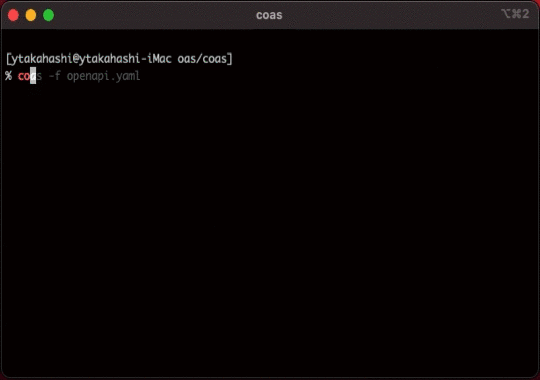

# coas

[](https://opensource.org/licenses/Apache-2.0)

Command line tool to see OAS3 file.



## Usage

```
Usage:
  coas [flags]

Flags:
  -b, --build           if specified, builds url interactively
  -c, --config string   config file (default: $HOME/.coas/config.yaml)
  -f, --file string     OAS3 file path
  -h, --help            help for coas
```

## Config File

`-f` option is omitted if config file.
Path to oas files can be written in config file as follows:

```yaml
oasFiles:
  - '/path/to/api.yaml'
  - '/path/to/another_api.yaml'
```
